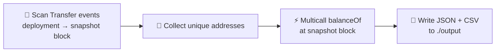

# 📸 ERC20 Snapshot

> Capture every holder of any ERC20 token at any block — one command, zero fuss.

[](https://github.com/JoeyKhd/erc20-snapshot)
[](LICENSE)
[](https://nodejs.org)
[](https://www.typescriptlang.org/)
[](https://viem.sh)
[](https://github.com/JoeyKhd/erc20-snapshot/commits/main)

## 📚 Table of contents

- [✨ Features](#-features)
- [🧠 How it works](#-how-it-works)
- [📋 Requirements](#-requirements)
- [🚀 Getting started](#-getting-started)
- [▶️ Usage](#-usage)
- [📂 Output](#-output)
- [⚠️ Good to know](#-good-to-know)
- [📄 License](#-license)

## ✨ Features

- 🔍 **Full holder discovery** — scans every `Transfer` event since the token's deployment.
- ⛓️ **Any block** — snapshot on an exact block number or a tag (`latest`, `safe`, `finalized`, …).
- ⚡ **Multicall balances** — resolves all `balanceOf` calls in batched multicalls, not one-by-one.
- 🚦 **Rate-limit friendly** — configurable batch size and sleep timeout between batches.
- 📊 **Ready-to-use reports** — JSON + CSV output, plus a details file of the parameters used.

## 🧠 How it works



1. Scans all `Transfer` events of the token contract, from its deployment block up to the snapshot block, in configurable batches.
2. Collects every address that ever sent or received the token.
3. Resolves each address's balance at the snapshot block via a single multicall of `balanceOf`.
4. Writes the results to `./output` as JSON and CSV, plus a details file with the parameters used.

## 📋 Requirements

- [Node.js](https://nodejs.org) 18 or higher
- An RPC endpoint (HTTP or WebSocket) for the chain the token lives on
  - 🗄️ An **archive node** is required when snapshotting on a historical block

## 🚀 Getting started

```bash
git clone https://github.com/JoeyKhd/erc20-snapshot.git
cd erc20-snapshot
npm install
cp .env.skel .env
```

Then fill in `.env`:

| Variable           | Description                                                                                         |
| ------------------ | --------------------------------------------------------------------------------------------------- |
| `RPC_URL`          | RPC endpoint of the chain node (`https://` or `wss://`).                                            |
| `DEPLOYMENT_BLOCK` | Block at which the token contract was deployed.                                                     |
| `SNAPSHOT_BLOCK`   | Block to snapshot on: a block number or a tag (`latest`, `earliest`, `pending`, `safe`, `finalized`). |
| `BLOCKS_PER_BATCH` | Amount of blocks scanned per batch when collecting `Transfer` events.                               |
| `SLEEP_TIMEOUT`    | Delay in milliseconds between batches to avoid rate limiting.                                       |
| `CONTRACTADDRESS`  | Address of the ERC20 token contract.                                                                |

## ▶️ Usage

```bash
npm start
```

Sit back — progress and the remaining time estimate are logged per batch. ⏱️

## 📂 Output

Reports are written to `./output`:

| File                          | Contents                                             |
| ----------------------------- | ---------------------------------------------------- |
| `report-snapshot-<block>.json` | Array of `{ address, balance }` records              |
| `report-snapshot-<block>.csv`  | Same data in CSV format                              |
| `report-details-<block>.json`  | The parameters the snapshot was taken with           |

**JSON example**

```json
[
  {
    "address": "0x1234567890abcdef1234567890abcdef12345678",
    "balance": "1000000000000000000"
  }
]
```

**CSV example**

```csv
Address,Balance,Snapshot Block
0x1234567890abcdef1234567890abcdef12345678,1000000000000000000,19000000
```

## ⚠️ Good to know

- 💰 Balances are **raw** uint256 amounts — they are **not** adjusted for the token's `decimals`.
- 🧹 Addresses that ever held the token are included, even if their balance at the snapshot block is `0`.
- 🗄️ Historical snapshots require an archive node; most free RPC tiers only serve recent state.

## 📄 License

[ISC](LICENSE) © [JoeyKhd](https://github.com/JoeyKhd)
